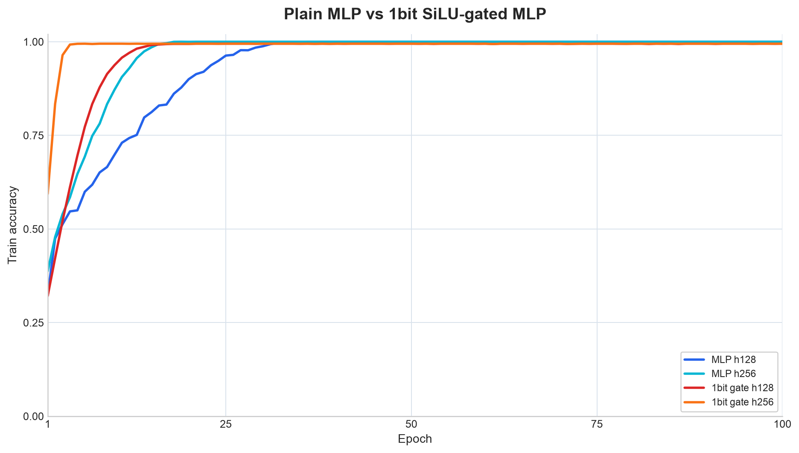
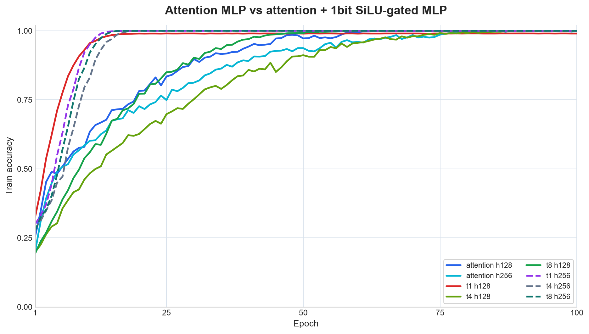

# 1bit + gate MLP

Experiments on [greydanus/mnist1d](https://github.com/greydanus/mnist1d) with four
small sequence classifiers:

- `mlp`: a plain MLP over the 40-dimensional 1D input
- `attention_mlp`: patch embedding, attention blocks, and an MLP head
- `onebit_gate_mlp`: `-1/+1` binary up/down projections with float SiLU gates
- `attention_onebit_mlp`: attention followed by the 1bit SiLU-gated MLP

The 1bit models do not keep shadow or latent float weights for binary parameters.
Binary weights are updated directly with Bop flips over `-1/+1`. Float parameters
such as SiLU gates, LayerNorm, heads, and attention layers are updated normally
with AdamW.

## Results

These charts show 100-epoch train accuracy. `h128` and `h256` refer to
`--hidden-dim`. The plain attention MLP uses `depth=2` for h128 and `depth=1`
for h256 because the h256 depth-1 setting overfits cleanly. For
attention+1bit MLP, `t1/t4/t8` correspond to `--binary-bases 1/4/8`.

### MLP

Plain MLP vs 1bit SiLU-gated MLP.



### Attention

Attention MLP vs attention+1bit SiLU-gated MLP.



## Setup

```bash
nix develop
uv sync
```

## Train

```bash
uv run train-1d-mnist --model mlp --epochs 5
uv run train-1d-mnist --model attention_mlp --epochs 5
uv run train-1d-mnist --model onebit_gate_mlp --epochs 5 --weight-decay 0
uv run train-1d-mnist --model attention_onebit_mlp --binary-bases 8 --epochs 5 --weight-decay 0
```

The MNIST-1D frozen dataset is downloaded on first run to
`data/mnist1d/raw/mnist1d_data.pkl`. The default split is train 4000 / test 1000
with input length 40.

## Useful Options

```bash
uv run train-1d-mnist --help
uv run train-1d-mnist --model attention_mlp --patch-size 5 --depth 2 --hidden-dim 128
uv run train-1d-mnist --model mlp --batch-size 256 --lr 1e-3
uv run train-1d-mnist --model onebit_gate_mlp --bop-threshold 1e-4 --bop-gamma 1e-4
uv run train-1d-mnist --model attention_onebit_mlp --binary-bases 8 --patch-size 5
```

## References

- Koen Helwegen et al., [Latent Weights Do Not Exist: Rethinking Binarized Neural Network Optimization](https://arxiv.org/abs/1906.02107), 2019.
- Noam Shazeer, [GLU Variants Improve Transformer](https://arxiv.org/abs/2002.05202), 2020.
- Sam Greydanus and Dmitry Kobak, [Scaling Down Deep Learning with MNIST-1D](https://arxiv.org/abs/2011.14439), 2020.
- Hongyu Wang et al., [BitNet: Scaling 1-bit Transformers for Large Language Models](https://arxiv.org/abs/2310.11453), 2023.
